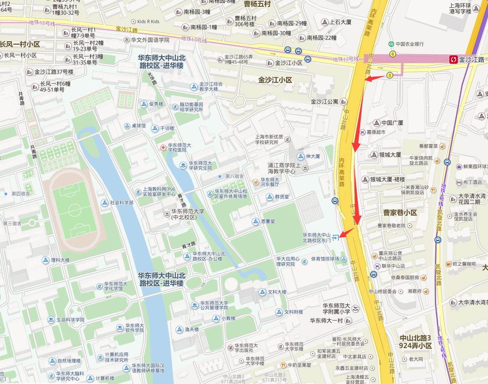

## 位置 ##
华东师范大学(中北校区)位于 中国上海普陀区中山北路3663号，邮编200062。

地铁__3,4,13__号线均可到达，站点为__金沙江路站(5号口出)__。
   

## 交通 ##
<a href="./map.jpg" style="cursor:hand">地铁线路图</a>

### 飞机 ###

#### 浦东国际机场 ####
- 地铁：浦东国际机场 - 2号线东延伸段 – 广兰路 – 2号线 – 世纪大道 – 4号线(浦东大道方向) – 金沙江路(5号口出) ~90min
- 出租车：￥200 ~60min

#### 虹桥机场 #####
- 地铁： 虹桥机场 - 2号线 - 中山公园 – 3号线 – 金沙江路(5号口出) ~30min
- 出租车：￥52 ~20min

### 火车 ###

#### 虹桥火车站 ####
- 地铁：虹桥火车站 - 2号线 - 中山公园 – 3号线 – 金沙江路(5号口出) ~30min
- 出租车：￥52 ~20min

#### 上海火车站 ####
- 地铁：上海火车站- 3号线/4号线 – 金沙江路(5号口出) ~10min
- 出租车： ￥25 ~15min

#### 上海南站 ####
- 地铁：上海南站 - 3号线 – 金沙江路(5号口出) ~20min
- 出租车： ￥32 ~18min

## 酒店 ##

- 7天连锁酒店(上海华师大店)
 - 上海市普陀区中山北路3636号,近金沙江路(华东师范大学正门对面)
 - 021-62237177

- 锦江之星(上海华师大店)
 - 地址：上海普陀区中山北路3500号5幢，近宁夏路
 - 021-62859998
 
- 海友上海华师大客栈
 - 上海市普陀区中山北路3612号，近金沙江路，紧邻华东师范大学(正门斜对
 - 021-52821606

- 桔子精选酒店上海中山公园店
 - 上海市普陀区中山北路3880号
 - 021-31277887

- 布丁酒店上海华师大金沙江地铁站店
 - 上海华师大金沙江地铁站店位于凯旋北路1555弄2号(近宁夏路口)
 - 021-62858006

- 上海盈超酒店华师大金沙江路地铁站店 
 - 上海普陀区凯旋北路1555弄2号
 - 021-62858087

- 海友酒店(上海金沙江路店)
 - 上海普陀区凯旋北路1555弄2层
 - 021-62858089

- 安悦酒店上海华师大店
 - 上海市普陀区宁夏路679号 
 - 021-62231000

- 上海悦·清水湾会议中心
 - 凯旋北路1305号
 - 021-62858000
 
- 上海多来米连锁酒店华师大店 
 - 上海普陀区梅岭支路5号
 - 021-51621060

- 如家快捷酒店(上海金沙江路大渡河路地铁站店)
 - 上海市普陀区中江路823号(13号线大渡河路站4号出口步行50米)
 - 021-52839800

- 如家快捷上海中山公园地铁站店
 - 上海长宁区武夷路589号(靠近中山公园地铁站)
 - 021-31217001

- 上海M家社区酒店金沙江路店  
 - 上海普陀区金沙江路730号(金沙江路怒江路交叉口)
 - 021-62582366
